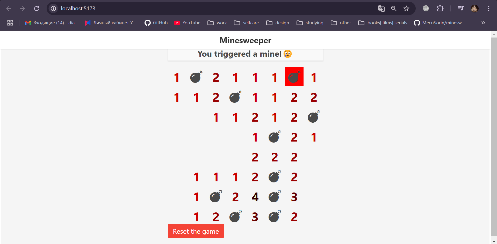
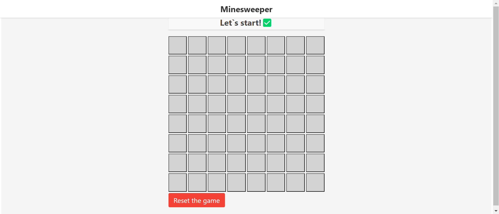

# Лабораторная работа №4
# Сапер

Выполнила: Савельева Диана Александровна, P34082, 388291

## Задание

Цель: Разработать и внедрить веб-приложение "Minesweeper", которое представляет собой реализацию классической
игры "Сапёр" с использованием современных технологий и инструментов.


### Инструменты
* Fable - инструмент для компиляции F# в JavaScript.
* Elmish - архитектура для создания клиентских приложений с использованием F#.
* React
* Fable.Elmish.React Template

### Требования
* [.NET 6](https://www.microsoft.com/net/download/core) or higher
* [node.js](https://nodejs.org) 4.8.2 or higher
* npm: JS package manager

### Запуск

Запуск осуществляется с помощью специального скрипта ```build.fsx```.
Он охватывает все стадии формирования проекта, от установки зависимостей до запуска.
Флаг --watch помогает не только запустить build, но и само приложение на порту 5173.


```
dotnet fsi build.fsx --watch
```

### Скриншоты

#### 1. Проигрыш пользователя


#### 2. Основное меню


## Вывод

Работа с Fable оказалась одновременно интересной и сложной.
Основной трудностью стало развёртывание проекта и настройка всех необходимых зависимостей.
В частности, потребовалось много времени, чтобы корректно подключить Fable CLI,
настроить работу с dotnet и совместить это с использованием npm-пакетов.
Разрешение конфликтов версий инструментов и зависимостей также добавило свою долю сложности.

Однако, несмотря на сложности, Fable оказался довольно удобным инструментом для разработки. У него есть:
* Шаблоны проектов, которые позволяют быстрее стартовать;
* Поддержка современных технологий, таких как SASS, что делает стилизацию гибкой и мощной;
* Возможность интеграции с экосистемой JS, что расширяет возможности разработчиков.

В общем, Fable предоставляет все необходимые инструменты для создания качественного front-end
на основе F#. Однако из-за обилия зависимостей и особенностей экосистемы dotnet и npm его
развертывание может стать вызовом, особенно для новичков.
С правильной настройкой и немного терпения Fable превращается в мощный инструмент для
создания интерактивных и стилизованных веб-приложений.
